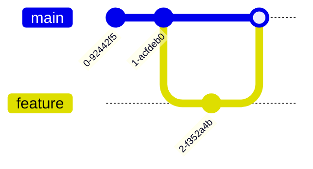

# Git and GitHub Learning Guide

This guide is designed for beginners to understand Git and GitHub concepts step-by-step. It includes explanations, commands with examples, and visual aids where helpful. Follow along with the sequence to build your understanding progressively.

## 1. What is Git?

**Git** is a **distributed version control system** (DVCS) that tracks changes in your files and directories over time. It allows multiple people to work on the same project without overwriting each other's work. 

- Created by Linus Torvalds in 2005.
- Stores the entire history of the project locally on your machine.
- Enables collaboration, branching, and reverting changes easily.

**Key Features:**
- Speed and efficiency
- Data integrity (uses cryptographic hashes)
- Branching and merging


*Visualization: Think of Git as a timeline of your project's changes.*

## 2. What is GitHub?

**GitHub** is a web-based platform that provides hosting for Git repositories. It adds collaboration features on top of Git:

- Remote storage for your repositories (so others can access them)
- Issue tracking, pull requests, code reviews
- Wikis, GitHub Pages, Actions (CI/CD)
- Social coding features like starring, forking

GitHub is not Git itself — it's a service built around Git (there are alternatives like GitLab, Bitbucket).


## 3. Difference between Git and GitHub

| Aspect          | Git                              | GitHub                              |
|-----------------|----------------------------------|-------------------------------------|
| Type            | Version control tool (software) | Hosting service / Platform         |
| Installation    | Installed locally               | Web-based (no install needed)      |
| Purpose         | Track local changes             | Share, collaborate on remote repos |
| Features        | Commit, branch, merge           | Pull Requests, Issues, Pages       |
| Access          | Works offline                   | Requires internet for collaboration|

**In short:** Git is the engine; GitHub is the garage where you store and share your cars (projects).

## 4. What is HEAD?

**HEAD** is a pointer in Git that references the **current commit** you're on (or the tip of the current branch).

- Usually points to the latest commit on your current branch.
- `HEAD~1` means the parent of HEAD (previous commit).
- Detaching HEAD means you're not on any branch (advanced).

You can check it with: `git log --oneline -5` or `cat .git/HEAD`

*Visual: HEAD is like your "current position" on the project's timeline.*

## 5. What is Branch and Commit?

- **Commit**: A snapshot of your project's files at a specific point in time. Each commit has a unique ID (SHA hash), message, author, and parent reference.
  - Immutable once created.

- **Branch**: A lightweight, movable pointer to a commit. It allows you to work on features independently.
  - Default branch is usually `main` or `master`.
  - Branches diverge from each other and can be merged later.

*Visual:*
```
main   *---*---*---* (commits)
         \
feature   *---* (new commits on branch)
```

## 6. Uses of Git/GitHub

- **Version Control**: Track who changed what and when.
- **Collaboration**: Multiple developers work simultaneously.
- **Backup & Recovery**: Revert mistakes easily.
- **Open Source**: Share code with the world.
- **Documentation & CI/CD**: Integrate with workflows.
- **Portfolio**: Showcase your projects.

## 7. What is Merge?

**Merge** integrates changes from one branch into another. It combines the histories.

Common command: `git merge <branch-name>`

There are different types of merges.

## 8. Fast-Forward Merge vs Merge Commit

- **Fast-Forward Merge**: Happens when the target branch has no new commits since the source branched off. Git simply moves the pointer forward. **No new commit created.**

  *Clean linear history.*

- **Merge Commit**: When both branches have diverged (new commits on both), Git creates a **new merge commit** that has two parents. This preserves the full history but can create "bubbles" in the graph.

**When to use:**
- Fast-forward is automatic when possible (clean).
- Use `--no-ff` to force a merge commit for clarity.

## 9. What is a Merge Commit?

A special commit with **two or more parents**. It records the point where branches were joined.

Example in log:
```
*   Merge commit 'abc123'  (merge commit)
|\
| * Commit on feature
* | Commit on main
```

## 10. What is Rebase?

**Rebase** replays your commits from one branch onto another branch's tip. It rewrites history to make it linear.

Command: `git rebase <base-branch>`

*Visual: Instead of merging with a commit, commits are "moved" to the end.*

## 11. Difference between Rebase and Merge

| Feature              | Merge                          | Rebase                          |
|----------------------|--------------------------------|---------------------------------|
| History              | Preserves original history     | Rewrites history (linear)      |
| New Commits          | Creates merge commit           | No merge commit                |
| Use Case             | Public/shared branches         | Feature branches (local)       |
| Conflicts            | Resolved once                   | May need to resolve per commit |
| Safety               | Safer for published history    | Risky if pushed already        |

**Golden Rule:** Never rebase public/shared branches.

## 12. What is Squash Commit?

**Squash** combines multiple commits into one. Useful for cleaning history before merging.

- `git merge --squash <branch>`
- Or `git rebase -i HEAD~n` and mark commits as `squash`.

Results in a cleaner, single commit representing the feature.

## 13. Git Clone vs Git Fork

- **Git Clone**: Copies a repository to your local machine. You get a full copy linked to the original (origin remote).
  ```bash
  git clone https://github.com/user/repo.git
  ```

- **Git Fork**: On GitHub, creates your own copy of someone else's repository under your account. Allows you to experiment and submit Pull Requests back to the original.

**Difference:** Clone is local download. Fork is a remote copy for contributing.

## 14. How to Check History of a File

```bash
# Basic log
git log --oneline filename.txt

# With changes
git log -p filename.txt

# Graphical blame (who changed what line)
git blame filename.txt

# History graph
git log --graph --oneline --all
```

---

## Hands-on Commands with Explanations

Let's walk through the commands you used. These build understanding progressively.

### Prepare File/Directory For Git

```bash
mkdir Naresh          # Create project directory
cd Naresh             # Navigate into it
touch first.txt       # Create empty file
touch second.txt
echo "first" > first.txt   # Add content
echo "second" > second.txt
```

**Use case:** Setting up your initial project files.

### Initialize Git Repo

```bash
git init              # Initialize empty Git repository
git status            # Check current state (untracked files)
```

This creates a `.git` folder for tracking.

### Add Files to Git

```bash
git add first.txt     # Stage specific file
git add second.txt
git status            # Shows staged changes
```

**Staging area** is where you prepare changes for commit. Use `git add .` for all files.

### Configure User Info (Before Commit)

```bash
git config --global user.email "naresh.sajwani1612@gmail.com"
git config --global user.name "Naresh Sajwani"
git config --list     # Verify settings
```

Essential for commit authorship.

### Make First Commit

```bash
git commit -m "Commit-1"   # Commit staged changes with message
git status
git log --oneline --graph --all  # View history
```

Good commit messages are clear and descriptive.

### Branching

```bash
git branch            # List branches (asterisk shows current)
```

### Update File & Second Commit

```bash
echo `date` >> first.txt   # Append current date
git add first.txt
git commit -m "Commit-2"
git log
git log --oneline --graph --all
```

Demonstrates how changes create new commits.

### Create New Branch

```bash
cd /home/sandbox/mywork   # (adjust path as needed)
git checkout -b NewBranch # Create and switch to new branch
echo "third" > third.txt
git add third.txt
git commit -m "Commit-3"
```

**Branching workflow:** Develop features in isolation.

### Merging Features (Example)

```bash
git checkout master                    # Switch back to main branch
git merge feature/tablespace-monitoring # Merge feature
git log --oneline --graph --all

# Second merge
git merge feature/ansible-automation
git log --oneline --graph --all
```

**Visual of merge:**
After merges, your log graph will show branches joining.

---

## Tips for GitHub Page

1. Push this repo to GitHub:
   ```bash
   git remote add origin <your-repo-url>
   git branch -M main
   git push -u origin main
   ```

2. Enable GitHub Pages in repo settings for a nice website.

3. Add more visuals using tools like [Mermaid](https://mermaid.js.org/) for diagrams in Markdown:



Happy Learning! 🚀
